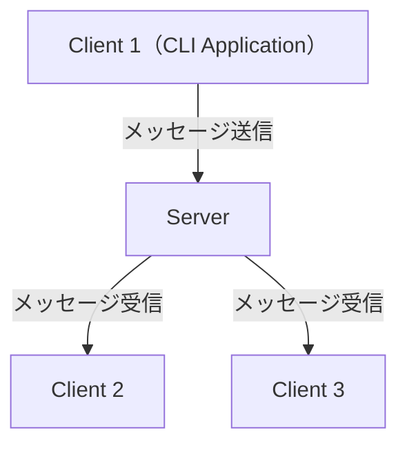

# チャットアプリ with Rust + Axum + WebSocket

[![GitHub Actions workflow badge - CI][github-actions-badge-ci]][github-actions-url-ci]

[github-actions-badge-ci]: https://github.com/nukopy/chat-app-rs/actions/workflows/ci.yml/badge.svg?branch=main
[github-actions-url-ci]: https://github.com/nukopy/chat-app-rs/actions/workflows/ci.yml?query=branch:main

Layered Architecture / DDD を採用した、Rust + Axum + WebSocket のチャットアプリ

## 技術スタック

- Rust 1.90.0
- Axum 0.8.6

## システム構成



## 機能

- **リアルタイムチャット**:
  - クライアント間でメッセージを送受信（送信者自身には送信されない）
- **参加者管理**:
  - 接続時に現在の参加者一覧を表示（`room-connected`）
  - 新規参加者の入室通知（`participant-joined`）
  - 参加者の退室通知（`participant-left`）
  - 各参加者の入室タイムスタンプ（ミリ秒精度、JST）
- **接続管理**:
  - ユニークな `client_id` による識別
  - 重複 `client_id` の接続拒否（HTTP 409 Conflict）
  - 自動再接続機能（5秒間隔、最大5回）
- **サーバ機能**:
  - グレースフルシャットダウン（Ctrl+C / SIGTERM）
  - クライアント接続状態の管理
- **メッセージタイプ**:
  - `room-connected`: 初回接続時の参加者一覧
  - `participant-joined`: 参加通知
  - `participant-left`: 退出通知
  - `chat`: チャットメッセージ

## サービス概要

- `bin/server`: WebSocket チャットサーバ。接続中のクライアント間でメッセージをブロードキャストします（送信者自身には送信されません）
- `bin/client`: インタラクティブなチャットクライアント。ユニークな `client_id` で接続し、再接続機能を持ちます

## 実行

### サーバの起動

```sh
cargo run --bin server
```

help

```sh
cargo run --bin server -- --help
```

### クライアントの起動

```sh
cargo run --bin client -- --client-id alice

# 別ターミナルで起動
cargo run --bin client -- --client-id bob
```

help

```sh
cargo run --bin client -- --help
```

### 特徴

- 各クライアントはユニークな `client_id` で識別されます
- 同じ `client_id` での重複接続は拒否されます（HTTP 409 Conflict）
- メッセージは送信者以外の全クライアントにブロードキャストされます
- サーバは Ctrl+C でグレースフルシャットダウンします
- クライアントは接続断時に自動再接続を試みます（5秒間隔、最大5回）
